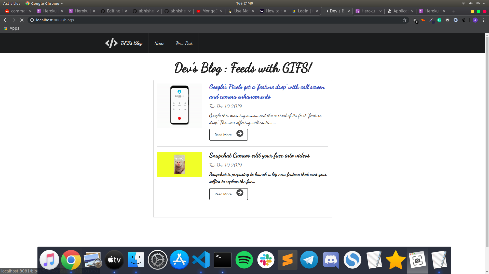
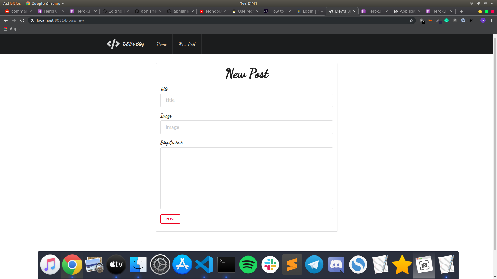
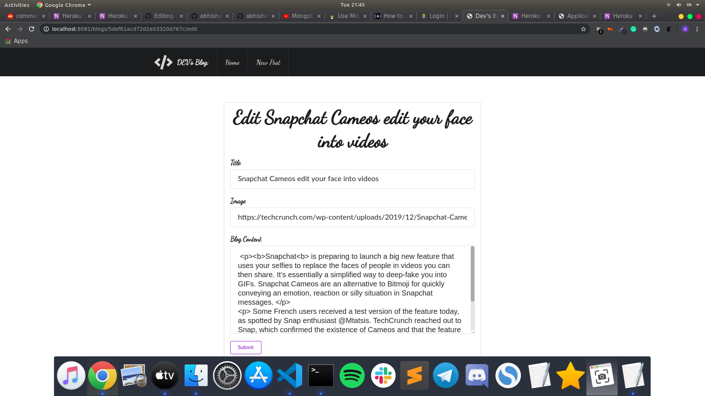

# DEV's BLOG

Blog for developer's, Where developer's get the latest news and updates of Tech World in the form of GIF's!

## FEATURE'S :

```diff
+ SEMANTIC UI
```
```diff
+ CRUD FUNCTIONALTIES
```
```diff
+ OUT OF THE BOX BLOG
```

## DEVELOPMENT :

1. Clone the Repo
   `https://github.com/abhisheknaiidu/Dev-s-Blog.git`
   
2. cd `Dev-s-Blog`

3. Install dependencies
   `npm install`
   
4. `npm run serve`

5. open `localhost:8081`

## SCREENSHOTS :

```diff
+ BLOG'S HOME PAGE :

```



```diff
+ POST PAGE :

```


```diff
+ NEW POST PAGE :

```



```diff
+ EDIT POST PAGE :

```



